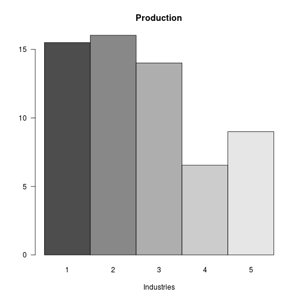

Open Leontief Solver
========================================================
author: Federico Viscioletti 
date: 1/17/2018
autosize: true


The Shiny app developed is a solver for the Open Leontief model

- The Open Leontief model is part of a branch of operational research called Input-Output analysis
- It is a way to describe and model an economy where there is external demand outside of the interrelated industries
- Is opposed to the Closed Leontief model which viceversa describes an economy without any external demand.


Consumption matrix
========================================================

The core of the Shiny app is represented by a function which randomly generates a consumption matrix. The matrix represents the flows among each sector of the economy described


```r
# generates a t x t productive economy consumption matrix
generateOpen <- function(t) {
        m <- NULL
        for (i in 1:t) {
                m <- cbind(m, c(runif(t, min = 0, max = (1/t))))
        }
        return(m)
}

# generates a 5 x 5 consumption matrix
C <- generateOpen(5); C
```

```
           [,1]        [,2]       [,3]       [,4]       [,5]
[1,] 0.05196315 0.001709079 0.13115225 0.14470496 0.14678618
[2,] 0.18773509 0.129728629 0.05104274 0.17018239 0.07635296
[3,] 0.05661618 0.072484933 0.02676390 0.01471367 0.02002455
[4,] 0.18242872 0.108715813 0.01329368 0.01267179 0.12398623
[5,] 0.19840444 0.193807618 0.04263355 0.19687806 0.06412431
```


Demand Vector
========================================================

To generate a demand vector, which is a random vector of external demand volumes, we will use the same random function, and select just the first column and multiplying it by 100, this will be our demand vector  


```r
# generates a random external demand vector for all five industries
D <- 100 * generateOpen(5)[, 1]; D
```

```
[1] 10.5644990  8.5272264 11.3181492  0.5906018  0.3526755
```

Solving the model
========================================================

Internal consumption is $C \times P$. So if P is our production vector and $D$ our demand, $P - C \times P = D$, the consumption of external industries.

We of course want to find the level of production that meets internal and external demand.

$$P - C \times P = P (I - C) = D$$

If $C$ is productive (sum of each row/col is less than 1), $(I - C)$ is guaranteed to be invertible.


```r
p <- solve(diag(5) - C)%*%D; p
```

```
          [,1]
[1,] 15.503286
[2,] 16.034257
[3,] 14.009622
[4,]  6.547039
[5,]  8.999492
```

Conclusion
========================================================

Using this we can answer some useful questions like: 

 - Given current external demand, what should every industry be producing?


```r
barplot(p, main = "Production", beside = TRUE, xlab = "Industries", names.arg = c("1", "2", "3", "4", "5"), las = 1)
```



Sources
========================================================

The repository for all the Shiny code developed is hosted here: https://github.com/feddernico/open-leontief-solver/

 - https://www.youtube.com/watch?v=1p3Xlo5hqys
 - https://youtube.com/watch?v=UxVbDJ3ERas
 - http://www.math.ksu.edu/~gerald/leontief.pdf
 - http://home2.fvcc.edu/~dhicketh/LinearAlgebra/studentprojects/spring2006/nicholaskallem/Leontief%20project.htm
 - https://www.math.ucdavis.edu/~daddel/linear_algebra_appl/Applications/Leonteif_model/Leontief_model_9_19/Leontief_model_9_19.html
 - Math-23 and Paul Bamberg's R Scripts
