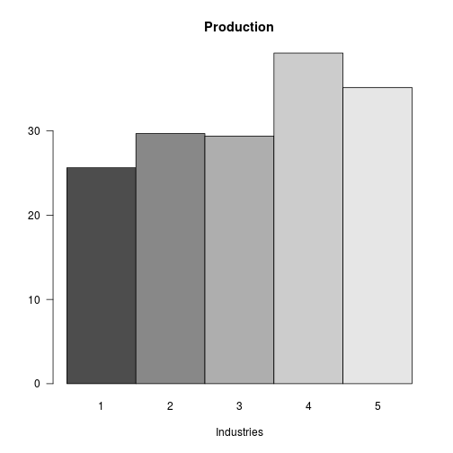

Open Leontief Solver
========================================================
author: Federico Viscioletti 
date: 1/17/2018
autosize: true

Introduction
========================================================

The Shiny app developed is a solver for the Open Leontief model

- The Open Leontief model is part of a branch of operational research called Input-Output analysis
- It is a way to describe and model an economy where there is external demand outside of the interrelated industries
- Is opposed to the Closed Leontief model which viceversa describes an economy without any external demand.

Consumption matrix
========================================================

The core of the Shiny app is represented by a function which randomly generates a consumption matrix. The matrix represents the flows among each sector of the economy described


```r
# generates a t x t productive economy consumption matrix
generateOpen <- function(t) {
        m <- NULL
        for (i in 1:t) {
                m <- cbind(m, c(runif(t, min = 0, max = (1/t))))
        }
        return(m)
}
```

Consumption matrix - example
========================================================


```r
# generates a 5 x 5 consumption matrix
C <- generateOpen(5); C
```

```
           [,1]       [,2]       [,3]      [,4]        [,5]
[1,] 0.13256509 0.10052067 0.17162627 0.1849844 0.131007339
[2,] 0.02108311 0.10925409 0.04003027 0.1418987 0.004603454
[3,] 0.06226669 0.11259534 0.10161268 0.1828923 0.108361316
[4,] 0.08269088 0.13911674 0.03982031 0.1958233 0.008007206
[5,] 0.13050310 0.04126243 0.12438263 0.1782822 0.002100724
```


Demand Vector
========================================================

To generate a demand vector, which is a random vector of external demand volumes, we will use the same random function, and select just the first column and multiplying it by 100, this will be our demand vector  


```r
# generates a random external demand vector for all five industries
D <- 100 * generateOpen(5)[, 1]; D
```

```
[1]  6.213963 13.316138 14.949756  7.714547  7.489735
```

Solving the model
========================================================

Internal consumption is $C \times P$. So if P is our production vector and $D$ our demand, $P - C \times P = D$, the consumption of external industries.

We of course want to find the level of production that meets internal and external demand.

$$P - C \times P = P (I - C) = D$$

If $C$ is productive (sum of each row/col is less than 1), $(I - C)$ is guaranteed to be invertible.

Solving the model - view
========================================================


```r
p <- solve(diag(5) - C)%*%D; p
```

```
         [,1]
[1,] 20.65049
[2,] 19.32305
[3,] 25.92876
[4,] 16.51432
[5,] 17.18741
```

Conclusion
========================================================

Using this we can answer some useful questions like: Given current external demand, what should every industry be producing?


```r
barplot(p, main = "Production", beside = TRUE, xlab = "Industries", names.arg = c("1", "2", "3", "4", "5"), las = 1)
```



Sources
========================================================

 - https://www.youtube.com/watch?v=1p3Xlo5hqys
 - https://youtube.com/watch?v=UxVbDJ3ERas
 - http://www.math.ksu.edu/~gerald/leontief.pdf
 - http://home2.fvcc.edu/~dhicketh/LinearAlgebra/studentprojects/spring2006/nicholaskallem/Leontief%20project.htm
 - https://www.math.ucdavis.edu/~daddel/linear_algebra_appl/Applications/Leonteif_model/Leontief_model_9_19/Leontief_model_9_19.html
 - Math-23 and Paul Bamberg's R Scripts
